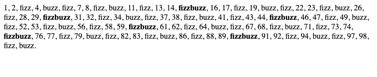

# fizzbuzz

## Bienvenido! 👋

Cuando te presentas a un trabajo de programador tal vez debas resolver un problema llamado fizzbuzz, este busca conocer tus conocimientos, veamos cómo resolverlos

Primero debes conocer cómo calcular el residuo de una división, ahora puedes llevar esto a código

Recuerda:

- Para calcular el módulo puedes usar %
- Los programas dividen los programas complejos en problemas pequeños
- La operación lógica and (y) se escribe en JavaScript con &&

El reto: 

Escribe los números del 1 al 100 pero si el numero es múltiplo de 3 escribe fizz, si el numero es múltiplo de 5 escribe buzz y si el numero es múltiplo de 3 y 5 escribe fizzbuzz